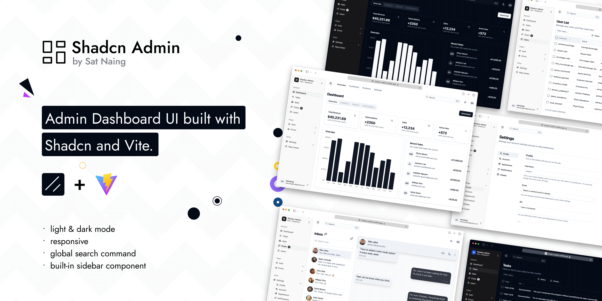

# Lite ATS

Lite ATS is a Vite, React, and TypeScript admin dashboard for local applicant
tracking workflows. It extends the shadcn-admin dashboard with local
email/password authentication, SQLite-backed RBAC, resume upload and preview,
and MinIO-backed PDF storage with expiring public share links.



## Features

- Single and bulk PDF/ZIP resume upload, metadata editing, preview, deletion,
  dashboard summaries, and expiring share links.
- Local Express API with SQLite persistence for resumes, users, roles,
  permissions, sessions, and job positions.
- MinIO object storage for uploaded PDF files.
- Local email/password authentication, Cloudflare Turnstile-protected account
  registration, and bearer-session API authorization.
- RBAC-protected navigation and workflows for resumes, job positions, users,
  roles, and permissions.
- Dashboard analytics, settings, authentication, and error pages.
- Responsive shadcn/ui interface with light/dark mode, RTL-capable primitives,
  and English / Simplified Chinese localization.

## Tech Stack

- React 19, TypeScript, Vite, and TanStack Router.
- shadcn/ui, Radix UI, Tailwind CSS, Lucide icons, and Recharts.
- Zustand for client auth/session state.
- Express 5 API with multer uploads.
- SQLite through better-sqlite3 and Kysely migrations.
- MinIO for local resume object storage.
- Vitest with Playwright browser mode for frontend tests.
- Vitest Node mode for server tests.

## Project Structure

```text
src/
  components/       shared UI, layout, tables, and app chrome
  context/          theme, layout, language, search, and direction providers
  features/         domain UI and API clients, including auth, resumes, RBAC,
                    job positions, dashboard, and settings
  hooks/            shared React hooks
  lib/              utilities, i18n, permissions, cookies, error handling
  routes/           TanStack file-based routes
  stores/           Zustand stores
  styles/           global CSS and theme tokens

server/
  app.ts            Express app and API routes
  index.ts          API bootstrap, migrations, local admin seed
  auth/             local auth, registration, Turnstile, sessions, RBAC
  job-positions/    job-position service and SQLite repository
  resumes/          MinIO storage, resume service, SQLite migrations

docker/
  Dockerfile        multi-stage production image
  docker-compose.yml  app and MinIO deployment with persistent volumes
```

## Getting Started

Install dependencies:

```bash
pnpm install
```

Create a local environment file:

```bash
cp .env.example .env
```

Start MinIO locally. One simple option is Docker:

```bash
docker run --rm \
  -p 9000:9000 \
  -p 9001:9001 \
  -e MINIO_ROOT_USER=minioadmin \
  -e MINIO_ROOT_PASSWORD=minioadmin \
  quay.io/minio/minio server /data --console-address ":9001"
```

Start the API:

```bash
pnpm run dev:api
```

Start the frontend in another terminal:

```bash
pnpm run dev
```

Open the Vite URL, usually `http://localhost:5173`. The Vite dev server proxies
`/api` requests to `http://localhost:3001`, so `VITE_RESUME_API_BASE_URL` can
stay empty for normal local development.

With the default `.env.example` values, the API creates a local admin user on
first startup:

```text
Email: admin@example.com
Password: password123
```

Change those credentials before sharing a local database or deploying the API.
To enable self-registration, configure `VITE_TURNSTILE_SITE_KEY` and
`TURNSTILE_SECRET_KEY`. Login with an existing or seeded account continues to
work when those keys are unset.

## Docker Compose

Build the application image and start Lite ATS with MinIO:

```bash
docker compose --env-file .env -f docker/docker-compose.yml up --build -d
```

For a local deployment, open `http://localhost:<APP_PORT>`. For a remote
deployment, open `http://<server-ip>:<APP_PORT>` and allow the configured
`APP_PORT` through the server firewall, or route that port through a reverse
proxy. The default application port is `3001`. The MinIO console is available
on port `9001`. Compose stores SQLite and MinIO data in named volumes, so both
survive container restarts.

The Compose commands pass the root `.env` explicitly because the Compose file
lives in `docker/`; without `--env-file .env`, Compose looks for
`docker/.env`. Change `LOCAL_ADMIN_PASSWORD` and the MinIO credentials before
exposing the deployment. API requests and generated resume links use the
browser's current origin by default, so they work when the app is reached
through a server IP, a custom port, or an HTTPS reverse proxy. Set
`RESUME_API_PUBLIC_URL` only when generated API resource URLs must use a
different public origin, such as a separately hosted API. Loopback values such
as `http://localhost:3001` fall back to safe same-origin paths.

Set both `VITE_TURNSTILE_SITE_KEY` and `TURNSTILE_SECRET_KEY` in the root
`.env` file before building the Compose deployment. The public site key is
embedded into the frontend during the Docker image build, while the secret is
passed only to the API container at runtime. Rebuild the image with `--build`
after changing the site key.

Check the deployment or stop it with:

```bash
docker compose --env-file .env -f docker/docker-compose.yml ps
docker compose --env-file .env -f docker/docker-compose.yml logs -f app
docker compose --env-file .env -f docker/docker-compose.yml down
```

## Environment Variables

| Variable                           | Default                       | Purpose                                                             |
| ---------------------------------- | ----------------------------- | ------------------------------------------------------------------- |
| `VITE_RESUME_API_BASE_URL`         | empty                         | Optional browser API origin. Leave empty when using the Vite proxy. |
| `VITE_CLERK_PUBLISHABLE_KEY`       | empty                         | Optional Clerk publishable key for the separate Clerk demo routes.  |
| `VITE_DEFAULT_QUERY_STALE_TIME_MS` | `10000`                       | Default TanStack Query cache freshness duration in milliseconds.    |
| `VITE_USERS_ROUTE_STALE_TIME_MS`   | `30000`                       | Users route loader cache freshness duration in milliseconds.        |
| `VITE_TURNSTILE_SITE_KEY`          | empty                         | Public Turnstile site key embedded during the frontend build.       |
| `TURNSTILE_SECRET_KEY`             | empty                         | Server-only Turnstile secret used to verify registration tokens.    |
| `APP_PORT`                         | `3001`                        | Express, container, and published host port used by Compose.        |
| `APP_STATIC_DIRECTORY`             | empty                         | Built frontend directory served by Express in production.           |
| `RESUME_API_HOST`                  | `127.0.0.1`                   | Address the Express API listens on. Compose overrides to `0.0.0.0`. |
| `RESUME_API_PORT`                  | `3001`                        | Express port outside Compose; Compose derives it from `APP_PORT`.   |
| `RESUME_API_PUBLIC_URL`            | empty                         | Optional public API origin for generated preview and share links.   |
| `RESUME_DATABASE_PATH`             | `server/.data/resumes.sqlite` | SQLite database path.                                               |
| `RESUME_SHARE_TTL_MINUTES`         | `60`                          | Lifetime for public resume share links.                             |
| `LOCAL_ADMIN_EMAIL`                | empty                         | Admin seed email. No admin is seeded when empty.                    |
| `LOCAL_ADMIN_NAME`                 | `Local Admin`                 | Admin seed display name.                                            |
| `LOCAL_ADMIN_PASSWORD`             | empty                         | Admin seed password. No admin is seeded when empty.                 |
| `MINIO_ENDPOINT`                   | `localhost`                   | MinIO endpoint hostname.                                            |
| `MINIO_PORT`                       | `9000`                        | MinIO API port.                                                     |
| `MINIO_USE_SSL`                    | `false`                       | Whether the MinIO client uses SSL.                                  |
| `MINIO_ACCESS_KEY`                 | `minioadmin`                  | MinIO access key.                                                   |
| `MINIO_SECRET_KEY`                 | `minioadmin`                  | MinIO secret key.                                                   |
| `MINIO_ROOT_USER`                  | unset                         | Alternative MinIO root username if API-specific keys are absent.    |
| `MINIO_ROOT_PASSWORD`              | unset                         | Alternative MinIO root password if API-specific keys are absent.    |
| `MINIO_BUCKET`                     | `resumes`                     | Bucket used for uploaded resume PDFs.                               |

## API Overview

The local API is mounted under `/api`.

- `GET /api/health` checks API health.
- `POST /api/auth/register` creates a Turnstile-verified `normal` account;
  `POST /api/auth/login`, `POST /api/auth/logout`, and `GET /api/auth/me`
  manage local sessions.
- `GET /api/resumes`, `GET /api/resumes/summary`, `POST /api/resumes`,
  `POST /api/resumes/bulk`, `PATCH /api/resumes/:id`,
  `DELETE /api/resumes/:id`, `GET /api/resumes/:id/file`, and
  `POST /api/resumes/:id/share` manage protected resume workflows and dashboard
  data.
- `GET /api/resume-shares/:token` streams a shared PDF without requiring auth
  until the token expires.
- `GET /api/job-positions`, `GET /api/job-positions/active`,
  `POST /api/job-positions`, `PATCH /api/job-positions/:id`, and
  `DELETE /api/job-positions/:id` manage active and inactive job positions.
- `GET /api/users`, `POST /api/users`, `PATCH /api/users/:id`,
  `DELETE /api/users/:id`, and `PUT /api/users/:id/roles` manage local users.
- `GET /api/roles`, `POST /api/roles`, `PATCH /api/roles/:id`,
  `DELETE /api/roles/:id`, `PUT /api/roles/:id/permissions`, and
  `GET /api/permissions` manage RBAC.

Protected API routes require an `Authorization: Bearer <sessionToken>` header.
System roles are seeded by migration: `admin` has all permissions, and
`normal` has read-only resume access.

## Scripts

```bash
pnpm run dev              # Start the Vite dev server
pnpm run dev:api          # Start the local Express API
pnpm run build            # Type-check and build the frontend
pnpm run preview          # Serve the production build locally
pnpm run start            # Start the Express API without watch mode
pnpm run lint             # Run ESLint
pnpm run format:check     # Check Prettier formatting
pnpm run format           # Format files with Prettier
pnpm run test             # Run frontend Vitest browser tests headlessly
pnpm run test:server      # Run server tests in Node mode
pnpm run test:coverage    # Run frontend tests with V8 coverage
pnpm run knip             # Report unused files, exports, and dependencies
```

If browser tests fail because Chromium is missing, install the browser runtime:

```bash
pnpm run test:browser:install
```

## Notes

- Uploaded resume files must be PDFs and are limited to 10 MB.
- API migrations run automatically when `pnpm run dev:api` starts.
- SQLite data defaults to `server/.data/resumes.sqlite`; remove or change that
  file when you need a clean local database.
- Do not commit `.env`, local databases, MinIO data, or other secrets.

## License

Licensed under the [MIT License](LICENSE).

This project is based on the shadcn-admin dashboard by Sat Naing and retains
the upstream MIT license.
